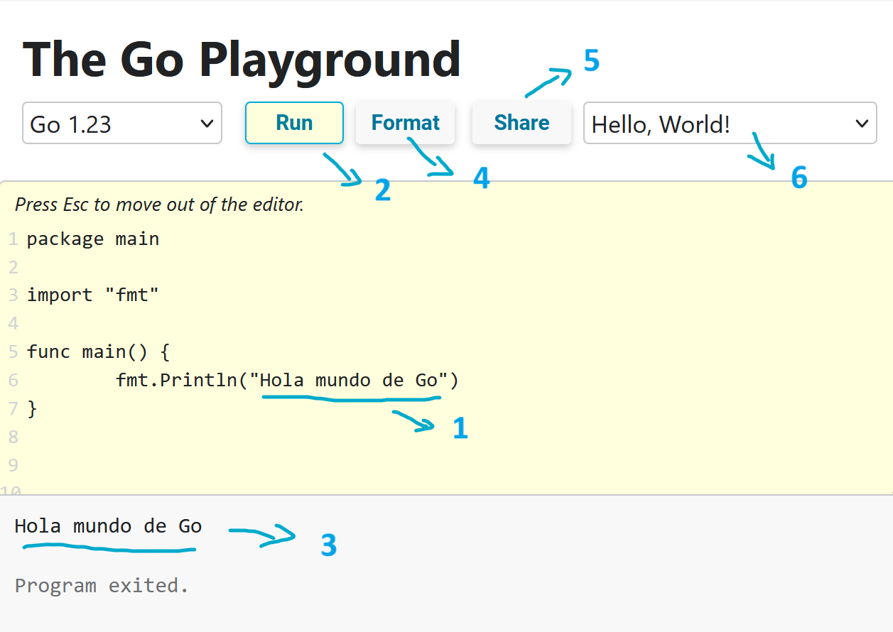

El Playground de Go es una herramienta muy útil para experimentar con el lenguaje de programación y para compartir código con otros programadores. Es muy fácil de usar y te permite probar diferentes ideas y soluciones sin preocuparte por la configuración de tu entorno de desarrollo.

## ¿Cómo utiliza el Playground de Go?

Para empezar a utilizar el Playground de Go, simplemente dirígete a la página oficial de Go Playground en tu navegador web. Allí verás un editor de código en el que puedes escribir tu programa en Go o también ingresar mediante este enlace: [Go Playground](https://play.golang.org/).

import { Steps } from '@astrojs/starlight/components';

<Steps>
    1. Edita el código en el editor de Playground de Go. Por ejemplo, puedes modificar el mensaje que se imprime en la pantalla.
    2. Haz clic en el botón "Run" para compilar y ejecutar el código.
    3. Observa el resultado de la ejecución en la parte inferior de la pantalla.
    4. Puedes usar le boton "Format" para formatear el código automáticamente.
    5. Si deseas compartir tu código con otros, puedes hacer clic en el botón "Share" para obtener un enlace único.
    6. Puedes ver mas ejemplo de código en el paso 6 de la imagen.

</Steps>

Además, el Playground de Go tiene una serie de características útiles, como la capacidad de guardar y cargar programas, la integración con GitHub, y la posibilidad de ver el resultado del programa en formato HTML.

## Limitaciones de Playground de Go

El Playground de Go es una herramienta muy útil para probar y compartir código en Go, pero también tiene algunas limitaciones. A continuación, se presentan algunas cosas que no se pueden hacer con el Playground de Go:

- No se puede interactuar con el sistema operativo: el Playground de Go se ejecuta en un entorno aislado en línea y no tiene acceso al sistema operativo en el que se ejecuta. Por lo tanto, no puedes realizar operaciones de E/S en el sistema de archivos, como leer o escribir archivos.

- No se pueden instalar paquetes externos: el Playground de Go viene con un conjunto predefinido de paquetes estándar, pero no permite instalar paquetes externos. Si necesitas utilizar un paquete que no está incluido en el conjunto estándar, deberás instalarlo en tu propia computadora.

- No se pueden ejecutar programas que requieren entrada de usuario: debido a que el Playground de Go se ejecuta en un entorno en línea, no es posible interactuar con el usuario para solicitar entrada en tiempo de ejecución. Por lo tanto, cualquier programa que requiera entrada del usuario no se puede ejecutar en el Playground de Go.