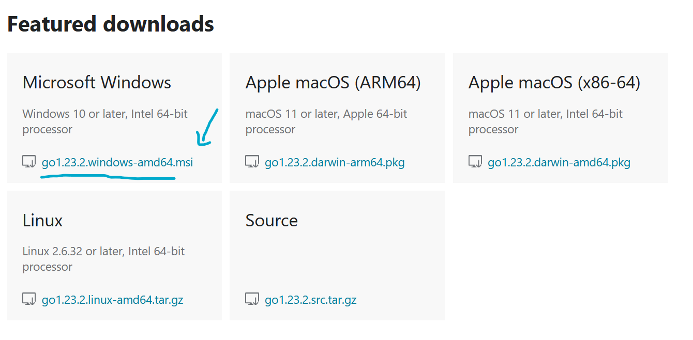
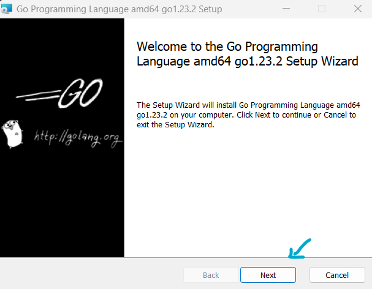
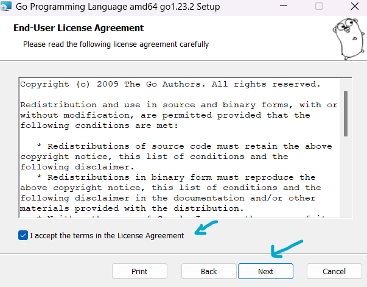
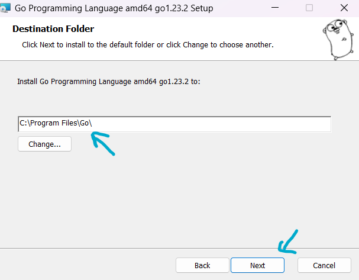
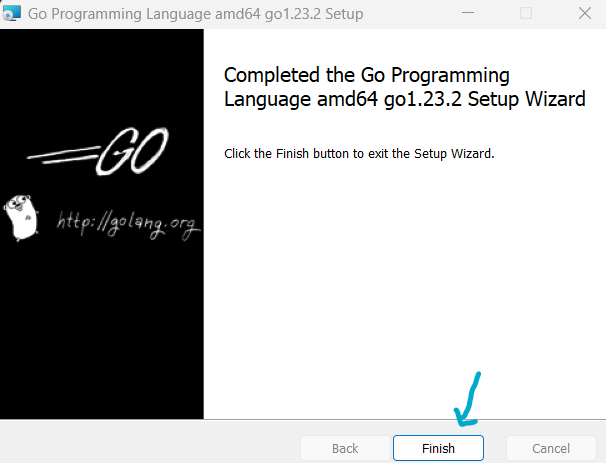
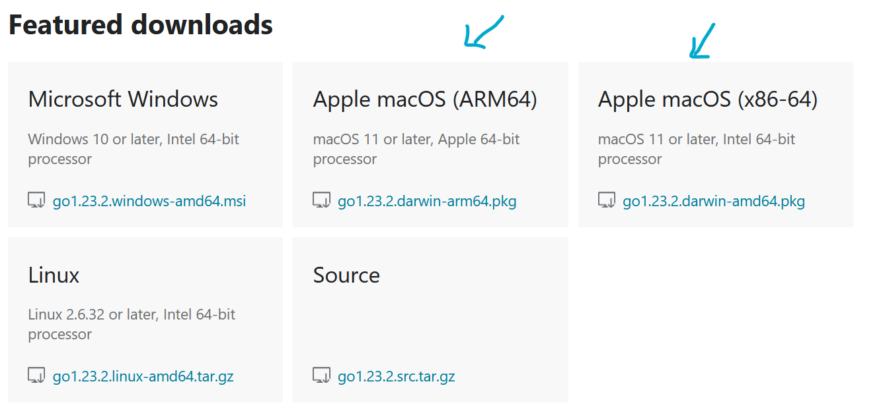
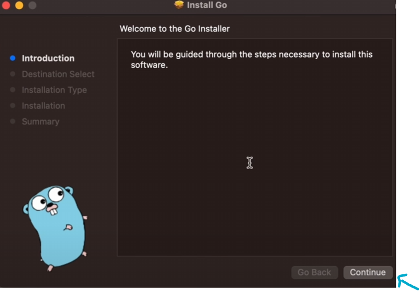
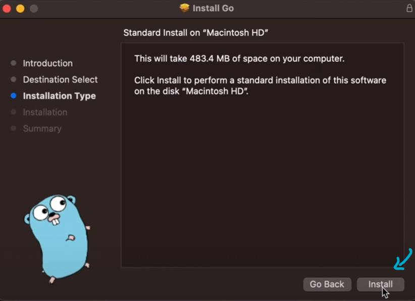
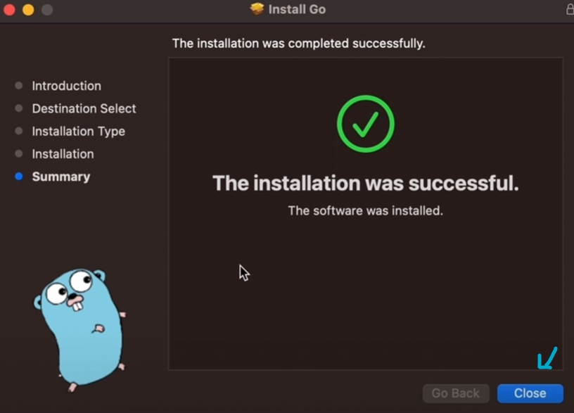
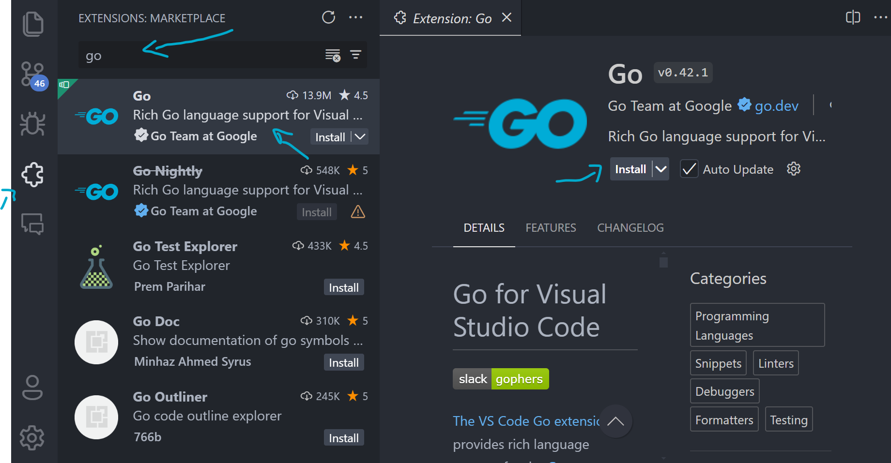

Para empezar a programar en Go, necesitaremos instalar el lenguaje de programación Go en nuestra computadora. En este artículo, aprenderemos cómo instalar Go en diferentes sistemas operativos y cómo configurar nuestro entorno de desarrollo para empezar a programar en Go.

## Instalación de Go
Para instalar Go en tu computadora, sigue los pasos a continuación según tu sistema operativo:

import { Tabs, TabItem, Steps } from '@astrojs/starlight/components';

<Tabs syncKey="os">
    <TabItem label="Windows" icon="seti:windows">
        Para instalar Go en Windows, sigue estos pasos:
        <Steps>
            1. Descarga el instalador de Go para Windows desde el sitio web oficial de Go (https://golang.org/dl/).

                

            2. Ejecuta el instalador de Go y sigue las instrucciones de instalación.

                
                
                Acepta los términos de la licencia y selecciona la ubicación de instalación. Puedes dejar las opciones predeterminadas o personalizarlas según tus preferencias.

                

                Verifica la ruta de instalación y haz clic en el botón "Next" para seguir con el siguiente paso. Luego, haz clic en el botón "Install" para comenzar la instalación de Go en tu computadora.

                

                
                
                Para finalizar la instalación, haz clic en el botón "Finish".

                

            3. Abre una nueva ventana de terminal o línea de comandos y ejecuta el comando `go version` para verificar que Go se ha instalado correctamente.

                ```shell
                go version
                ```
                Si el comando muestra la versión de Go instalada en tu computadora, significa que la instalación ha sido exitosa.
                ```shell	
                go version go1.23.2 windows/amd64
                ```

            4. ¡Listo! Ahora puedes empezar a programar en Go en tu computadora con Windows.

        </Steps>
    </TabItem>
    <TabItem label="Linux" icon="linux">
        Para instalar Go en Linux, sigue estos pasos:
        <Steps>
            1. Abre una terminal y ejecuta el siguiente comando para descargar el archivo de instalación de Go:

                ```bash
                wget https://go.dev/dl/go1.23.2.linux-amd64.tar.gz
                ```

                Este comando descargará el archivo de instalación de Go en tu computadora.

            2. Elimina cualquier instalación anterior de Go en tu computadora con el siguiente comando:

                ```bash
                sudo rm -rf /usr/local/go
                ```

                Este comando eliminará cualquier instalación anterior de Go en el directorio `/usr/local`.

            3. Descomprime el archivo de instalación de Go con el siguiente comando:

                ```bash
                sudo tar -C /usr/local -xzf go1.23.2.linux-amd64.tar.gz
                ```

                Este comando descomprimirá el archivo de instalación de Go en el directorio `/usr/local`.

                :::caution
                No descomprima el archivo en un árbol `/usr/local/go` existente. Se sabe que esto produce instalaciones de Go defectuosas.
                :::

            4. Configura las variables de entorno de Go ejecutando los siguientes comandos, puedes agregarlos al archivo `$HOME/.bashrc` o `$HOME/.profile` para que se carguen automáticamente al iniciar sesión:

                ```bash
                export PATH=$PATH:/usr/local/go/bin
                export GOPATH=$HOME/go
                export PATH=$PATH:$GOPATH/bin
                ```

                Estos comandos añadirán el directorio de instalación de Go al `PATH` y configurarán el `GOPATH` para tus proyectos de Go.

                - `PATH` es una variable de entorno que contiene una lista de directorios donde se buscan ejecutables.
                - `GOPATH` es una variable de entorno que especifica la ubicación de tu espacio de trabajo de Go.
                - `$GOPATH/bin` es el directorio donde se instalarán los binarios de Go.

                :::note
                Es posible que los cambios realizados en un archivo de `.profile` no se apliquen hasta la próxima vez que inicie sesión en su computadora. Para aplicar los cambios de inmediato, simplemente ejecute los comandos de shell directamente o ejecútelos desde el perfil utilizando un comando como `source $HOME/.profile`.

                ```bash
                source $HOME/.profile
                ```
                Si los cambios fuen en `.bashrc`:

                ```bash 
                exec bash
                ```
                :::

                

            5. Abre una nueva ventana de terminal y ejecuta el comando `go version` para verificar que Go se ha instalado correctamente.

                ```bash
                go version
                ```

                Si el comando muestra la versión de Go instalada en tu computadora, significa que la instalación ha sido exitosa.

            6. ¡Listo! Ahora puedes empezar a programar en Go en tu computadora con Linux.

        </Steps>
    </TabItem>
    <TabItem label="Mac" icon="apple">
        Para instalar Go en macOS, sigue estos pasos:
        <Steps>
            1. Descarga el archivo de instalación de Go para macOS desde el sitio web oficial de Go (https://golang.org/dl/).

                


            2. Haz doble clic en el archivo de instalación de Go descargado (`go1.23.2.darwin-amd64.pkg`) para iniciar el instalador de Go. Sigue las instrucciones del instalador para completar la instalación de Go en tu computadora.

                

                

                

            3. Abre una nueva ventana de terminal y ejecuta el comando `go version` para verificar que Go se ha instalado correctamente.

                ```bash
                go version
                ```

                Si el comando muestra la versión de Go instalada en tu computadora, significa que la instalación ha sido exitosa.

            4. ¡Listo! Ahora puedes empezar a programar en Go en tu computadora con macOS.

        </Steps>
    </TabItem>
</Tabs>

## Configuración de Go
Una vez que hayas instalado Go en tu computadora, es importante configurar tu entorno de desarrollo para trabajar con Go de manera eficiente. A continuación, se presentan algunas configuraciones recomendadas para empezar a programar en Go:

import { Card } from '@astrojs/starlight/components';

<Card title="Configuración del GOPATH" icon='seti:go'>
    El `GOPATH` es una variable de entorno que especifica la ubicación de tu espacio de trabajo de Go. Por defecto, el `GOPATH` se establece en `$HOME/go` en Linux y macOS, y en `%USERPROFILE%\go` en Windows. Puedes cambiar la ubicación del `GOPATH` si lo deseas, pero es recomendable mantenerlo en un directorio separado para evitar conflictos con otros proyectos de Go.
</Card>

<Card title="Configuración del editor de código" icon='laptop'>
    Puedes utilizar cualquier editor de código o IDE para programar en Go. Algunos editores populares para trabajar con Go incluyen Visual Studio Code (VSCode), Vim, Emacs y GoLand

    :::note
    Algunos editores tienen extensiones o complementos disponibles que facilitan el desarrollo en Go, como resaltado de sintaxis, autocompletado y depuración.
    :::

</Card>

<Card title="Configuración de la terminal" icon='seti:powershell'>
    Ser capaz de usar la terminal o línea de comandos es esencial para compilar y ejecutar programas escritos en Go. Debes aprender a navegar por los directorios, ejecutar comandos de compilación y ejecución, y gestionar tu entorno de desarrollo desde la línea de comandos.
</Card>

<Card title="Configuración de Git" icon='seti:git'>
    Git es un sistema de control de versiones distribuido que te permite realizar un seguimiento de los cambios en tu código a lo largo del tiempo. Con Git, puedes crear ramas para trabajar en nuevas características o solucionar problemas sin afectar la versión principal de tu código. También facilita la colaboración en proyectos de desarrollo de software, ya que varios desarrolladores pueden trabajar en paralelo y combinar sus cambios de manera eficiente.
</Card>

<Card title="Configuración de GitHub" icon='github'>
    GitHub es una plataforma de alojamiento de repositorios basada en la nube que utiliza Git. Permite a los desarrolladores almacenar y compartir su código fuente, colaborar en proyectos con otros desarrolladores y realizar un seguimiento de los cambios en el código. En GitHub, puedes crear repositorios públicos o privados para tus proyectos y utilizar diversas funciones, como solicitudes de extracción (pull requests) y problemas (issues), para facilitar la colaboración y la comunicación con otros miembros del equipo.

    :::note

    GitHub es una herramienta muy útil para compartir tu código con otros programadores y colaborar en proyectos de código abierto.

    :::
</Card>

¡Ahora estás listo para empezar a programar en Go! Con la instalación y configuración adecuadas, podrás crear aplicaciones en Go y aprovechar al máximo el lenguaje de programación Go. ¡Buena suerte! 🚀
`;

## Configuración de VSCode para Go

Lo más probable es que ya tengas instalado Visual Studio Code en tu computadora. Si no es así, puedes descargarlo desde el sitio web oficial de Visual Studio Code (https://code.visualstudio.com/). Una vez que tengas Visual Studio Code instalado, puedes configurarlo para trabajar con Go de manera eficiente.

### Instalación de la extensión de Go para Visual Studio Code

Para programar en Go con Visual Studio Code, necesitarás instalar la extensión de Go para Visual Studio Code. Sigue estos pasos para instalar la extensión de Go:



<Steps>
    1. Abre Visual Studio Code y haz clic en el icono de extensiones en la barra lateral izquierda para abrir la vista de extensiones.

    2. Busca "Go" en el campo de búsqueda y selecciona la extensión "Go" de la lista de resultados.

    3. Haz clic en el botón "Instalar" para instalar la extensión de Go en Visual Studio Code.

    4. Una vez que la extensión se haya instalado correctamente, verás un mensaje de confirmación y un botón de "Recargar" para reiniciar Visual Studio Code.
</Steps>

Ahora que has instalado la extensión de Go en Visual Studio Code, puedes empezar a programar en Go con todas las funciones y herramientas que ofrece la extensión. La extensión de Go proporciona funciones como resaltado de sintaxis, autocompletado, depuración y más para facilitar el desarrollo en Go con Visual Studio Code.


