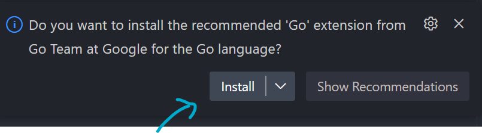

Ahora que ya tienes Go instalado en tu sistema, es hora de escribir tu primer programa en Go. En este tutorial, aprenderás a imprimir "Hola Mundo" en la consola con Go.ç

## Crear un proyecto Go

Para crear un nuevo proyecto Go, primero debes crear un directorio para tu proyecto. Puedes hacerlo con el siguiente comando:

```bash
mkdir hola-mundo
cd hola-mundo
```

Ahora podemos pasar abrir nuesto proyecto en tu editor de código favorito. En mi caso, usaré Visual Studio Code.

```bash
code .
```

## Crear un archivo Go
Dentro de tu proyecto, crea un nuevo archivo llamado `main.go`, nuestro proyecto tendrá la siguiente estructura:

import { FileTree } from '@astrojs/starlight/components';

<FileTree>

- hola-mundo/
  - hola.go

</FileTree>

Cuando bamos crear por primera vez un archivo de Go, te va pedir instalar herramientas de Go, acepta la instalación. Este mensaje te va a aparecer en la parte inferior derecha de tu editor de código.




## Hola Mundo con Go

Ahora, vamos a escribir nuestro primer programa en Go. Abre el archivo `hola.go` y escribe el siguiente código:

```go
package main

import "fmt"

func main() {
    fmt.Println("Hola Mundo")
}
```
- La primera línea `package main` indica que este archivo pertenece al paquete `main`. El paquete `main` es especial en Go y se utiliza para crear programas ejecutables.
- La segunda línea `import "fmt"` importa el paquete `fmt`, que contiene funciones para formatear la entrada y salida.
- La función `main` es la función principal de nuestro programa. Cuando ejecutas un programa Go, la función `main` es la primera función que se ejecuta.
- La función `fmt.Println("Hola Mundo")` imprime "Hola Mundo" en la consola.

Este programa imprime "Hola Mundo" en la consola. Para ejecutar el programa, puedes usar el siguiente comando:

```bash
go run hola.go
```

- El comando `go run hola.go` compila y ejecuta el programa Go en un solo paso. Deberías ver la salida `Hola Mundo` en la consola.

Otro comando que puedes usar para compilar y ejecutar el programa es:

```bash
go build hola.go
```

<FileTree>

- hola-mundo/
  - hola.go
  - **hola.exe** (o hola en Linux/Mac)

</FileTree>

Para ejecutar el programa compilado, puedes usar el siguiente comando:

```bash
./hola
```
 
- El comando `go build` compila el programa y genera un archivo ejecutable. El archivo ejecutable se llama `hola` en este caso. Luego, puedes ejecutar el archivo ejecutable con `./hola`.


¡Felicidades! Has escrito tu primer programa en Go. En el próximo tutorial, aprenderás sobre variables en Go.

